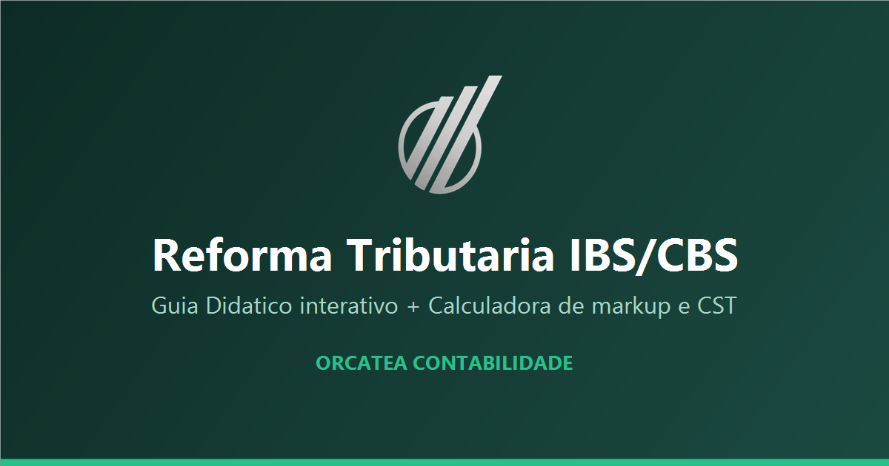

# 📘 Guia Didático & Calculadora — Reforma Tributária IBS/CBS

[](https://www.gnu.org/licenses/gpl-3.0)
[](https://github.com/JEAN-ALMEIDA-CZO/WIKI_REFORMA_TRIBUTARIA/issues)
[](https://github.com/JEAN-ALMEIDA-CZO/WIKI_REFORMA_TRIBUTARIA/commits)
[](https://jean-almeida-czo.github.io/WIKI_REFORMA_TRIBUTARIA/)
[](https://jean-almeida-czo.github.io/WIKI_REFORMA_TRIBUTARIA/)

Guia interativo completo sobre a **Reforma Tributária do Consumo (IBS, CBS e Imposto Seletivo)**, com **18 módulos didáticos** — do panorama legal à prática da apuração assistida — e uma **calculadora de markup e classificação CST/cClassTrib** para precificação na transição. Conteúdo baseado na **EC 132/2023** e na **LC 214/2025**, escrito para empresários, contadores e analistas fiscais.

<p align="center">
  
</p>

---

## 🌐 Acesse Online

Tudo roda direto no navegador, sem instalação:
👉 [**Abrir a Wiki da Reforma Tributária**](https://jean-almeida-czo.github.io/WIKI_REFORMA_TRIBUTARIA/)

> 📲 **Instale como aplicativo (PWA):** ao acessar pelo celular ou desktop, aceite o convite "Instalar o aplicativo" para usar offline, direto da tela inicial.

---

## ✨ Funcionalidades

### 📚 Guia Didático (18 módulos)
- 🧭 **Trilha de leitura** organizada por blocos (Fundamentos → Crédito e pagamento → Regimes especiais → Operação → Guias práticos)
- 🎚️ **Quatro camadas de profundidade** em cada módulo: da visão geral para empresários até as regras de ouro do analista (CST, cClassTrib, XML, DF-e)
- 🔎 **Busca instantânea** offline em todo o conteúdo
- 🗺️ **Mapa de conexões** e fluxos de preenchimento de nota fiscal
- 🔗 **Referências oficiais** vinculadas aos artigos da LC 214/2025

### 🧮 Calculadora de Markup e Classificação
- 💰 **Markup "por fora"** com preço de venda, margem e todos os tributos da transição
- 📅 **Cálculo híbrido por ano (2026 → 2033)**: IBS/CBS escalonados + ICMS/ISS e PIS/Cofins que coexistem na transição
- 🏷️ **Tabela CST × cClassTrib** com identificação de **monofásico**, redução de alíquota e "gera crédito?"
- 🔤 **Busca de NCM** com sugestão de classificação e ficha de cadastro pronta
- ⚖️ **Regimes**: Regular, Simples (dentro e fora do DAS) e comparativo

### 🤖 Extras
- 💬 **Assistente com IA** (opcional): responde offline pelo texto oficial dos módulos, ou com Claude / Gemini
- 🌗 **Tema claro/escuro** automático (segue a preferência do sistema)
- 📋 **Copiar e compartilhar** códigos, trechos e links

---

## 🛠️ Tecnologias Utilizadas

- **HTML5, CSS3 e JavaScript (vanilla)** — sem framework, carregamento leve
- **PWA** — Service Worker + Web App Manifest (funciona offline e é instalável)
- **Python** — gerador estático que converte os módulos Markdown em dados de busca
- **APIs Anthropic (Claude) e Google (Gemini)** — modo IA opcional, configurável pelo usuário
- **GitHub Pages** — hospedagem estática

---

## 🧩 Estrutura do Projeto

- `documentacao/index.html` — aplicação da documentação (SPA)
- `documentacao/app.js` — navegação, busca, renderização e assistente
- `documentacao/reforma-tributaria.html` — calculadora de markup + CST/cClassTrib
- `documentacao/build_docs.py` — gera o `docs-data.js` a partir dos módulos Markdown
- `Guia_Didatico_IBS_CBS/` — os 18 módulos em Markdown (fonte do conteúdo)

---

## 🚀 Como Usar

### Online (recomendado)
Basta acessar 👉 [jean-almeida-czo.github.io/WIKI_REFORMA_TRIBUTARIA](https://jean-almeida-czo.github.io/WIKI_REFORMA_TRIBUTARIA/)

### Rodar localmente

1. **Clone o repositório**:

   ```bash
   git clone https://github.com/JEAN-ALMEIDA-CZO/WIKI_REFORMA_TRIBUTARIA.git
   ```

2. **Sirva a pasta por um servidor local** (o modo IA e o Service Worker exigem `http://`, não abra por `file://`):

   ```bash
   cd WIKI_REFORMA_TRIBUTARIA/documentacao
   python -m http.server 8080
   ```

3. Abra **http://localhost:8080/index.html** no navegador.

4. **(Opcional) Regenerar os dados** após editar os módulos Markdown:

   ```bash
   python build_docs.py
   ```

---

## ⚖️ Aviso

Material **didático e de apoio**, baseado na EC 132/2023 e na LC 214/2025. As alíquotas de referência ainda não estão fixadas em definitivo — os valores usados na calculadora são **estimativas oficiais** e devem ser confirmados antes de qualquer decisão fiscal. Não substitui orientação profissional.

---

## 📄 Licença

Distribuído sob a licença **GNU GPL 3.0** — veja [LICENSE](https://www.gnu.org/licenses/gpl-3.0) para detalhes.
